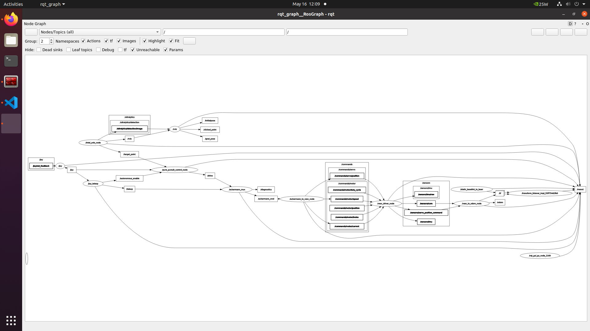

# f1tenth_system

Drivers onboard f1tenth race cars. This branch is under development for migration to ROS2. See the [documentation of F1TENTH](https://f1tenth.readthedocs.io/en/foxy_test/getting_started/firmware/index.html) on how to get started.

## Control
On Logitech F-710 joysticks, in manual control mode: the RT button is the throttle, the LT button is the reverse, the left analog stick is the steering and the deadman's switch is the A button. In autonomous control mode the deadman's switch is the X button and the constans speed can be adjust with the up and down buttons.

## Topics

### Topics that the driver stack subscribe to
- `/drive`: Topic for autonomous navigation, uses `AckermannDriveStamped` messages.

### Sensor topics published by the driver stack
- `/scan`: Topic for `LaserScan` messages.
- `/odom`: Topic for `Odometry` messages.
- `/sensors/imu/raw`: Topic for `Imu` messages.
- `/sensors/core`: Topic for telemetry data from the VESC

## External Dependencies

1. ackermann_msgs [https://index.ros.org/r/ackermann_msgs/#foxy](https://index.ros.org/r/ackermann_msgs/#foxy).
2. urg_node [https://index.ros.org/p/urg_node/#foxy](https://index.ros.org/p/urg_node/#foxy). This is the driver for Hokuyo LiDARs.
3. joy [https://index.ros.org/p/joy/#foxy](https://index.ros.org/p/joy/#foxy). This is the driver for joysticks in ROS 2.
4. teleop_tools  [https://index.ros.org/p/teleop_tools/#foxy](https://index.ros.org/p/teleop_tools/#foxy). This is the package for teleop with joysticks in ROS 2.
5. vesc [GitHub - f1tenth/vesc at ros2](https://github.com/f1tenth/vesc/tree/ros2). This is the driver for VESCs in ROS 2.
6. ackermann_mux [GitHub - f1tenth/ackermann_mux: Twist multiplexer](https://github.com/f1tenth/ackermann_mux). This is a package for multiplexing ackermann messages in ROS 2.
<!-- 7. rosbridge_suite [https://index.ros.org/p/rosbridge_suite/#foxy-overview](https://index.ros.org/p/rosbridge_suite/#foxy-overview) This is a package that allows for websocket connection in ROS 2. -->

## Package in this repository

1. f1tenth_stack: maintains the bringup launch and all parameter files
2. cone_pkg: /custom package/ contains the cone identification node and pure pursuit control node for navigate between cones
3. ackermann_mux: maintains the switching between control topics (teleop, drive)
4. teleop_tools: maintains the hardware controlling methods (joy, keyboard, etc.)
5. vesc: maintains the communication between the nodes and the vesc motor controller

## Control values

1. steering_angle = [-0.34, 0.34] rad:
   - topic: teleop, drive
   - type: AckermannDrive
   - unit: radians
   - maximum steering angle: 20° = 0.34 rad.
   - left steering: 0-0.34 rad
   - no steering: 0 rad
   - right steerng: -0.34-0 rad
   - The ackermann_to_vesc node converts this value into a number between 0 and 1 for the VESC.
   - For the conversation (vesc.yaml):
      - scale: -1.2135
      - offset: 0.5304
   - Safety feature:
      - higher value then 0.34 rad will be clipped for the safety of servo motor and other parts

2. speed = [-min, max] m/s:
   - topic: teleop, drive
   - type: AckermannDrive
   - unit: m/s
   - reverse: -min-0
   - forward: 0-max
   - Minimum and maximum speed can be adjust in vesc.yaml
   - The controller's input value [m/s] is converted into RPM value in the ackermann_to_vesc node
   - For the conversation (vesc.yaml):
      - scale: 4200
      - offset: 0
   - Safety feature:
      - the maximum RPM (10k RPM) is limited by the VESC motor controller

## Nodes launched in bringup

1. joy
2. joy_teleop
3. ackermann_to_vesc_node
4. vesc_to_odom_node
5. vesc_driver_node
6. urg_node
7. ackermann_mux
8. intel_yolo
9. pure_pursuit_control

## Parameters and topics for dependencies

### vesc_driver

1. Parameters:
   - duty_cycle_min, duty_cycle_max
   - current_min, current_max
   - brake_min, brake_max
   - speed_min, speed_max
   - position_min, position_max
   - servo_min, servo_max
2. Publishes to:
   - sensors/core
   - sensors/servo_position_command
   - sensors/imu
   - sensors/imu/raw
3. Subscribes to:
   - commands/motor/duty_cycle
   - commands/motor/current
   - commands/motor/brake
   - commands/motor/speed
   - commands/motor/position
   - commands/servo/position

### ackermann_to_vesc

1. Parameters:
   - speed_to_erpm_gain
   - speed_to_erpm_offset
   - steering_angle_to_servo_gain
   - steering_angle_to_servo_offset
2. Publishes to:
   - ackermann_cmd
3. Subscribes to:
   - commands/motor/speed
   - commands/servo/position

### vesc_to_odom

1. Parameters:
   - odom_frame
   - base_frame
   - use_servo_cmd_to_calc_angular_velocity
   - speed_to_erpm_gain
   - speed_to_erpm_offset
   - steering_angle_to_servo_gain
   - steering_angle_to_servo_offset
   - wheelbase
   - publish_tf
2. Publishes to:
   - odom
3. Subscribes to:
   - sensors/core
   - sensors/servo_position_command

## Graph of nodes

